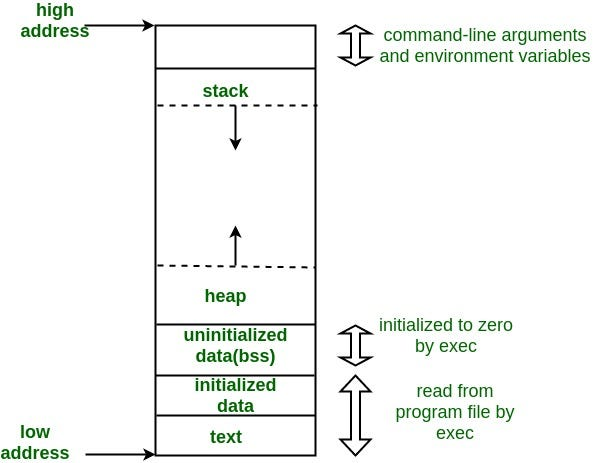

# To demonstrate how a stack-based buffer overflow can overwrite adjacent memory variables and cause unexpected behavior.

## Process Memory Layout

When a program runs, memory is divided into sections:

1. Text Segment → Stores program instructions
2. Initialized Data → Global/static initialized variables
3. BSS Segment → Uninitialized global/static variables
4. Heap → Dynamically allocated memory
5. Stack → Function calls and local variables

Important:

1. Heap grows upward
2. Stack grows downward

This is important for understanding buffer overflow.

## What is a Buffer?

    - A buffer is a temporary storage area in memory.
    - It is used to hold data while it is being transferred from one place to another.
    Example:
        char name[10];

    - This reserves 10 bytes in memory.

## What is Buffer Overflow?

    - when a program writes more data to a buffer than it can hold, it is called a buffer overflow.
    - Extra data overwrites adjacent memory.
    - That memory may contain:
        - Return address
        - Function pointers
        - Other variables

    - This leads to system instability, data corruption, and security vulnerabilities:
        - Crash
        - Control hijacking
        - Code execution

##### Buffer overflow occurs when a program writes more data into a fixed-size memory buffer than it can hold, causing adjacent memory corruption. This may overwrite local variables or even the return address, potentially leading to arbitrary code execution. It is common in C due to lack of bounds checking. Prevention includes secure coding practices, bounded input functions, and system-level defenses like ASLR and stack canaries.



## Stack Memory Layout

    - When the function vulnerable() executes, local variables are stored inside the stack frame.
    - In memory, it looks conceptually like this:

    ```
    | isAdmin (4 bytes) |
    | buffer (8 bytes)  |
    ```

    - Both variables are stored next to each other in stack memory.

## What is Buffer Overflow?

    - A buffer overflow occurs when more data is written into a buffer than it can hold.
    - char buffer[8];

    - The buffer can store only 8 characters.
    - The function: gets(buffer); -> does NOT check input size.

    - If the user enters more than 8 characters, extra characters continue writing into adjacent memory.

## What Happened During Execution?

Input: aaaaaaaaaaaaaaaaaaaaaaaa

1. First 8 characters fill buffer
2. Remaining characters continue writing into memory
3. They overwrite the adjacent variable isAdmin

## Conclusion

    - Buffer overflow can lead to unexpected behavior by overwriting adjacent memory variables.
    - In this case, the isAdmin variable was overwritten, causing the program to print "Admin access granted!" even though the user did not have admin privileges.
    - This demonstrates how buffer overflows can be exploited to manipulate program behavior and potentially gain unauthorized access.
